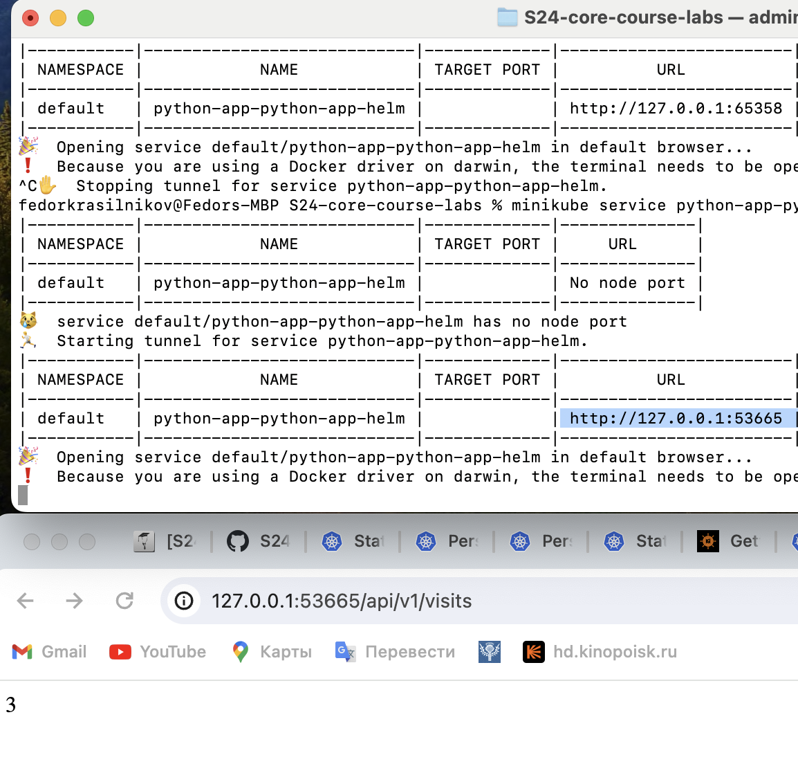

## 

Here is the output of `kubectl get po,sts,svc,pvc`
```
NAME                                          READY   STATUS    RESTARTS       AGE
pod/java-app-java-app-helm-84fff68478-rh9xh   1/1     Running   2 (140m ago)   11d
pod/python-app-python-app-helm-0              1/1     Running   0              13m
pod/python-app-python-app-helm-1              1/1     Running   0              14m
pod/vault-0                                   1/1     Running   2 (140m ago)   12d
pod/vault-agent-injector-7f46dc49f-ch5jf      1/1     Running   2 (140m ago)   12d

NAME                                          READY   AGE
statefulset.apps/python-app-python-app-helm   2/2     27m
statefulset.apps/vault                        1/1     12d

NAME                                 TYPE        CLUSTER-IP      EXTERNAL-IP   PORT(S)             AGE
service/java-app-java-app-helm       ClusterIP   10.111.35.233   <none>        8081/TCP            19d
service/kubernetes                   ClusterIP   10.96.0.1       <none>        443/TCP             274d
service/python-app-python-app-helm   ClusterIP   10.101.35.205   <none>        5000/TCP            27m
service/vault                        ClusterIP   10.102.214.48   <none>        8200/TCP,8201/TCP   12d
service/vault-agent-injector-svc     ClusterIP   10.101.62.240   <none>        443/TCP             12d
service/vault-internal               ClusterIP   None            <none>        8200/TCP,8201/TCP   12d

NAME                                                        STATUS   VOLUME                                     CAPACITY   ACCESS MODES   STORAGECLASS   AGE
persistentvolumeclaim/visits-python-app-python-app-helm-0   Bound    pvc-221b2641-cc9a-4ff0-a247-8669075a0b09   256Mi      RWX            standard       27m
persistentvolumeclaim/visits-python-app-python-app-helm-1   Bound    pvc-2062ddf2-2552-44db-9b72-fd0f36eb3853   256Mi      RWX            standard       26m
```

I was able to access the application 


I was able to see that persistent violumes of two different pods held different content 


This happens because two different persistent volumes are mounted to these two pods. This fact makes the pods stateful as they hold different states (in our case they hold that state in `visits/visits.txt` file)

## Why ordering guarantees are unnecessary for your app
The main reason is that pods in a stetful set ususally have some persistent state, so they are unique. If one pod is down, we lose an access to that persistent storage, so the sequential operations on pods do not give us the same availability benefits as for the steteless apps. 

To launch or terminate all the pods in parallel I added the following line to the stateful set 

```
podManagementPolicy: "Parallel"
```

As we can see it worked, as both pods terminate at the same time now


